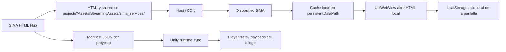

# Runtime HTML Sync

Este documento define cómo se publican y consumen los HTML de SIMA en runtime.

## Flujo completo



## Resumen técnico

La estrategia recomendada es:

- Unity consulta un manifest remoto por proyecto.
- El manifest lista archivos, hashes y base URL.
- Unity descarga únicamente los archivos que cambiaron.
- Los archivos quedan en almacenamiento local del dispositivo.
- UniWebView abre la copia local, no la remota, como ruta normal.

## Estructura del manifest

Ejemplo:

```json
{
  "schemaVersion": 1,
  "project": "cencomall",
  "version": "2026.06.19-1",
  "baseUrl": "https://cdn.example.com/sima/cencomall",
  "generatedAt": "2026-06-19T18:00:00.000Z",
  "hashAlgorithm": "sha256",
  "rollbackTo": "2026.06.18-3",
  "entryPoints": [
    {
      "service": "mobility",
      "entry": "mobility/index.html"
    }
  ],
  "files": [
    {
      "path": "shared/bridge.js",
      "size": 1024,
      "sha256": "..."
    }
  ]
}
```

## Reglas del manifest

- `schemaVersion` identifica la forma del documento.
- `project` identifica el asistente o mirror.
- `version` es la versión publicable del paquete.
- `baseUrl` apunta a la ubicación remota de los archivos.
- `rollbackTo` es opcional y sirve para retroceder a un paquete anterior.
- `entryPoints` marca qué HTML debe abrir Unity.
- `files` lista todo lo que debe validarse por hash.

## Comportamiento esperado en Unity

Unity debe:

1. Leer el manifest al iniciar o bajo demanda.
2. Comparar la versión local contra la remota.
3. Identificar los archivos faltantes o con hash distinto.
4. Descargar solo esos archivos.
5. Escribirlos en una carpeta local del dispositivo.
6. Abrir el HTML local desde UniWebView.
7. Si la descarga falla, conservar la versión anterior.

## Persistencia

El runtime sync no cambia la fuente de verdad del asistente:

- estado del asistente = Unity + `PlayerPrefs` + payloads del bridge;
- preferencias locales de una pantalla = `localStorage` solo si aplica;
- el cache de HTML es solo distribución de contenido, no persistencia funcional del usuario.

## Publicación

Flujo recomendado:

1. Actualizar el contenido en el repo HTML hub.
2. Generar el manifest del proyecto.
3. Publicar los assets y el manifest en el host remoto.
4. Subir la nueva versión del proyecto.
5. Monitorear que los dispositivos tomen la nueva versión.

## Dónde vive el código C#

La implementación C# recomendada vive en este mismo repo como paquete compartido para desarrolladores:

- `unity-runtime-sync/RuntimeHtmlManifest.cs`
- `unity-runtime-sync/RuntimeHtmlCache.cs`
- `unity-runtime-sync/RuntimeHtmlSyncService.cs`
- `unity-runtime-sync/RuntimeHtmlSyncConfig.cs`

Ese bloque no sustituye el código final dentro del proyecto Unity, pero sí funciona como fuente común para:

- revisar el contrato;
- copiar al proyecto Unity;
- versionar cambios;
- alinear el comportamiento entre asistentes.

### Ejemplo de uso en Unity

```csharp
using System.Threading.Tasks;
using UnityEngine;

public class HtmlBootstrap : MonoBehaviour
{
    [SerializeField] private RuntimeHtmlSyncService syncService;
    [SerializeField] private string initialService = "mobility";

    private async void Start()
    {
        if (syncService != null)
        {
            await syncService.SyncAsync();
            var localUrl = syncService.ResolveEntryUrl(initialService);
            if (!string.IsNullOrEmpty(localUrl))
            {
                // UniWebView.Load(localUrl);
                Debug.Log("Open HTML: " + localUrl);
            }
        }
    }
}
```

## Rollback

Si una versión rompe una pantalla:

1. Marcar `rollbackTo` al manifest estable anterior.
2. Volver a publicar el manifest estable.
3. Dejar que Unity vuelva a descargar la versión anterior.
4. Confirmar que la copia local quedó estable.
